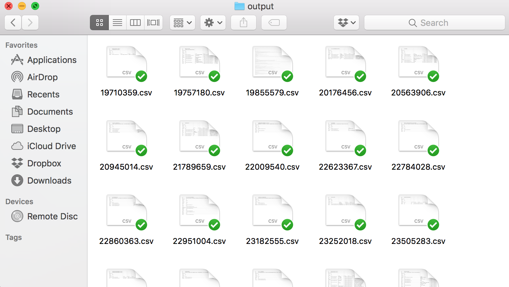

# Zhihu Crawler (English)

zhihu_crawler is yet another Zhihu crawler. Powered by Selenium and BeautifulSoup, it implements a multiple-process crawler with advanced features. 

### Main Features

- Fetch question list by topic search and fulltext search
- Fetch question content from question list
- Multiple Process for concurrent faster crawl

### Configurations

```python
config = {
            "topics":["制服"], 
            "search":["制服"],
            "output":"./output/",
            "answer_limit":"500",
            "jobs":"2",
         } 
```
- topics: Topic Keywords for topic search
- search: Keywords for fulltext search 
- output: Output directory
- answer_limit: Fetch first answer_limit answer for each questions
- jobs: Number of concurrent jobs (Process)


### About me

Adam429 Lee (adam429.lee@gmail.com). Looking for freelance tasks for data crawler and data annotation.

---------------------------------------------------------

# Zhihu Crawler (中文)

zhihu_crawler是知乎的数据爬虫。通过使用Selenium和BeautifulSoup等库，实现了包含多线程的高级功能爬虫的功能。

### 主要特性

- 话题关键字搜索和全文关键字搜索，通过搜索来形成问题列表
- 通过问题列表来获取每个问题的多个答案
- 使用多进程来获得更快的抓取速度

### 配置

```python
config = {
            "topics":["制服"], 
            "search":["制服"],
            "output":"./output/",
            "answer_limit":"500",
            "jobs":"2",
         } 
```
- topics: 搜索的话题列表
- search: 搜索的关键字列表
- output: 输出目录
- answer_limit: 对于每个问题，取前面answer_limit项进行抓取
- jobs: 同时执行的进程数量

### 输出



> 输出文件夹 (./output/)


> index.csv 问题索引文件


> 问题详情文件，里面有该问题下的所有回答


> 抓取回答中的图片


### 关于作者

Adam429 Lee (adam429.lee@gmail.com). 专业承接各种数据爬虫和数据标注工作。

